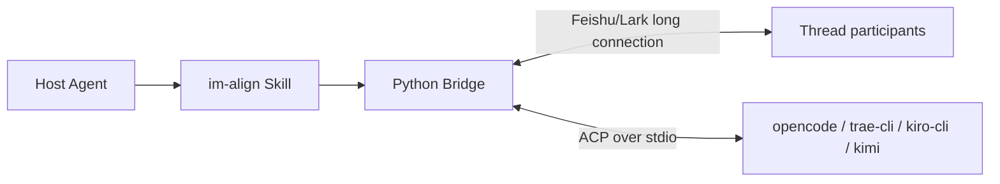

# im-align

im-align is an IM ↔ Coding Agent alignment tool distributed as an Agent Skill. A developer triggers the Skill inside the target repository, and an independent Python Bridge moves the alignment loop into a Feishu/Lark Thread so Product, Tech Lead, Operations, and other roles can participate. The Agent writes the final Spec back to the current repository.

Scope is strictly limited to pre-coding work: no coding, no branch creation, no commit or push, and no PR management.

## Architecture



- One Feishu/Lark Thread maps to one Session.
- The default Alignment Skill is `grill-with-docs` from the target repository.
- User replies are formatted as `Name: content` and sent to the Agent as soon as the current Turn is available.
- The Bridge replies to the Thread only after the Agent Turn finishes.
- The completion signal is strictly validated, and the Spec remains a local file in the current repository.
- After the Bridge exits, developers may continue with the backend's native session command, but im-align does not enter coding automatically.

See `docs/design.md` for the full design, `CONTEXT.md` for terminology, and `docs/adr/` for decisions.

## Installation

Requirements:

- macOS/Linux
- `uv`
- `opencode`, `traecli`, `kiro-cli`, or `kimi`
- A Feishu/Lark custom app configured for long connections

From the target repository, install im-align with the Skills CLI and select the host Agents when prompted:

```sh
npx skills add JoeShi/im-align
```

Alternatively, install it manually. The Skill is the whole directory, not only `SKILL.md`. Copy this repository into the host Agent's Skill directory, for example `.agents/skills/im-align/` in the target repository, and keep these files together:

```text
SKILL.md
agents/openai.yaml
scripts/
references/
pyproject.toml
uv.lock
```

In the development repository, verify from the root:

```sh
uv sync --frozen
uv run --frozen python scripts/bridge.py --help
```

## Feishu/Lark Setup

The Feishu/Lark app must enable bot capability and subscribe through long connections:

- Event: `im.message.receive_v1`

Scope definitions and detailed setup steps:

- `references/lark-scopes.json`
- `references/lark-e2e-simulator-scopes.json` (test-only bot Participant Mode)
- `references/feishu-setup.md`

Initial setup:

```sh
uv run --frozen python scripts/bridge.py setup
```

App Secret is written only to `~/.config/im-align/config.yaml` with file mode `0600`. Do not store credentials in the repository. See `references/config.md` for the configuration schema.

## Usage

Normally the host Agent invokes the Bridge according to `SKILL.md`. The same CLI also works directly for a developer without a host Agent:

```sh
# Start from the current git repository; returns run_id immediately.
uv run --frozen python scripts/bridge.py start "Align requirements for a CLI todo tool" --json

# Bounded wait: returns as soon as the run reaches a terminal state; --timeout is only an upper bound.
uv run --frozen python scripts/bridge.py wait <run-id> --timeout 600 --json

uv run --frozen python scripts/bridge.py status <run-id> --json
uv run --frozen python scripts/bridge.py stop <run-id> --json
uv run --frozen python scripts/bridge.py resume <run-id> --json
```

Participants reply in the newly created Feishu/Lark Thread and mention the bot. With the current `im:message.group_at_msg:readonly` scope, ordinary Thread replies that do not mention the bot are not delivered.

Terminal states:

- `done`: the Spec was written and passed freshness and repository-boundary validation.
- `idle_timeout`: the Session paused after inactivity; the original Thread and ACP session can be resumed.
- `failed`: environment or runtime error; fix the issue and resume.
- `stopped`: stopped from the terminal; resumable.

State and logs live under `~/.local/state/im-align/`.

## Safety Boundaries

- Work only inside the current git worktree at launch time; repository URLs are not accepted and repositories are not cloned.
- ACP file reads and writes are confined to the current repository, including real paths after symlink resolution.
- The Bridge applies a deterministic Permission Policy: read-only operations and edits inside `agent.spec_root` may proceed; other restricted operations are rejected without human interaction.
- Startup is rejected when the Agent Backend argv contains dangerous parameters such as `bypass_permissions`, `--yolo`, `trust-all-tools`, or `trust-tools`.
- The target repository must still configure the backend's own ask rules, such as `opencode.json`; otherwise the backend will not send permission requests. kiro-cli asks by default in measured versions, and its allowlist comes from `allowedTools` in host-level `~/.kiro/agents/*.json`. kimi is governed by `permission` in host-level `~/.kimi-code/config.toml`; its 0.42.0 default allows file writes without asking.
- Multiple WebSocket connections for the same Feishu/Lark app receive events by random distribution, so v1 uses a machine-level single-session lock.

## Directory Map

- `SKILL.md`: host Agent entry point and operating protocol.
- `scripts/bridge.py`: setup/start/wait/status/resume/stop CLI.
- `scripts/im_align/`: ACP, Feishu/Lark Provider, orchestration, state, and completion detection.
- `references/`: Feishu/Lark and configuration references.
- `.agents/skills/`, `.claude/skills/`: engineering Skills used while developing this project; they are not part of the im-align runtime.
