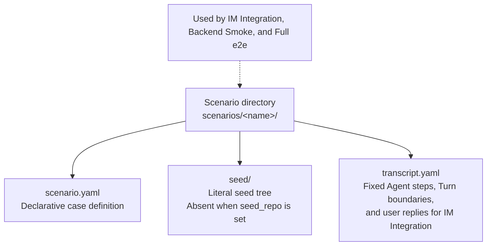
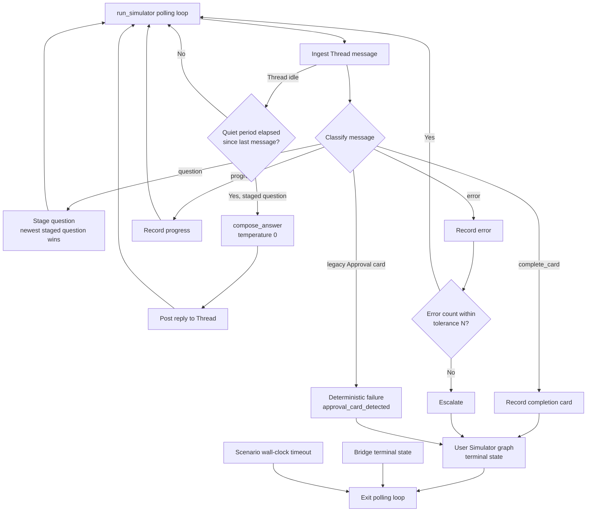
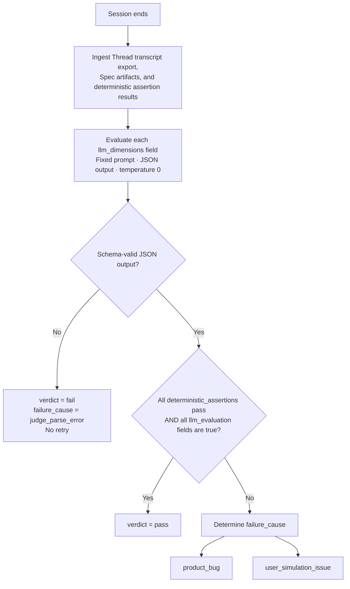

# E2E Test Harness Design

This document is the implementation contract for the four-layer verification model defined in `CONTEXT.md` (Unit Test, IM Integration, Backend Smoke, Full e2e). It supersedes the manual-only procedures in `docs/steering/e2e-test.md` for layers 2–4; that document remains the record of historical real-machine runs.

Product prerequisite: ADR-0005. The happy path is non-interactive because the Bridge decides every ACP permission request deterministically.

## Layer Model

| Layer | Agent side | IM side | Gate |
|---|---|---|---|
| Unit Test | none | none | PR, always |
| IM Integration | scripted multi-Turn fake ACP backend + fixed user Participant replies | real Feishu Thread | trusted main, serial |
| Backend Smoke | real Agent Backend + User Simulator (LLM) in supported `as-user` mode | real Feishu Thread | CI-embeddable |
| Full e2e | all Agent Backends × all Scenarios in supported `as-user` mode | real Feishu Thread | manual, on demand |

The machine-level single-session lock means Feishu-touching layers never run concurrently; the CI queues them.

## Scenario

One Scenario is one directory, shared by IM Integration, Backend Smoke, and Full e2e:



`scenario.yaml` fields:

```yaml
name: todo-greenfield
backend: opencode            # Agent Backend command; IM Integration ignores it
skill: grill-with-docs
requirement: |
  我想给个人项目加一个 TODO list 功能...
timeout_seconds: 900         # strict for Smoke, loose for Full e2e
spec_root: docs/adr/        # (optional) defaults to docs/adr/; repository-relative directory
seed_repo:                   # (optional) when set, seed/ must be absent
  url: https://github.com/org/repo
  ref: 8f3a2c1e...           # full SHA only; branch/tag names are rejected
expected_artifacts:          # sole source of truth for deterministic assertions
  - path: docs/adr/0001-*.md   # may be a glob, e.g. docs/adr/0001-*.md
    marker_line: "[ALIGNMENT_COMPLETE]"   # (optional) per artifact
llm_dimensions:              # declares RunEvaluator rubric fields; prompts auto-generated
  - agent_asked_clarifying_questions
  - questions_addressed_requirement_gaps
  - spec_content_covers_scenario_requirement
user_brief: |                # Scenario-specific product facts, not simulator instructions
  Product goal: Add a lightweight TODO list to a personal project.
  Target user: An individual managing personal tasks.
  In scope: Create, complete, and delete tasks; persist them in the browser.
  Out of scope: User accounts, cloud synchronization, and collaboration.
  Undecided: Frontend framework and task ordering behavior.
```

`requirement` is the initial request sent to the Agent Backend. The fixed User Simulator system prompt assigns the Product Manager role, defines the response policy, and requires direct answers in the format requested by the Agent Backend. `user_brief` contains only the Scenario-specific product facts that the Product Manager may use. This separation keeps Backend Smoke and Full e2e deterministic, prevents invented requirements and scope expansion, and avoids repeating prompt instructions in every Scenario.

## IM Integration Layer

- `tests/e2e/fake_acp_agent.py`: a generalization of the inline `FAKE_AGENT` in `tests/unit/test_acp_incident_replay.py`. A Python subprocess speaking JSON-RPC over stdio, driven by `transcript.yaml` instead of hardcoded behavior. `end_turn` finishes the current ACP prompt while preserving the remaining step iterator; the next real Thread reply causes the Bridge to send the next prompt and resume the script. Other steps send message chunks, request permissions, write artifacts (via the same repo-relative real-path rule as the fs capability), emit the completion marker, or hang/cancel for negative paths.
- `participant_replies` contains one fixed user line for every `end_turn`. The runner binds an `as-user` Participant adapter from `E2E_SIMULATOR_USER_ACCESS_TOKEN`, waits for the patched Agent question, posts the corresponding reply in the actual Thread, and requires that reply to be visible, emoji-acknowledged, and followed by a later Bridge-authored message. Completion is therefore impossible before a real user-originated event drives Turn 2.
- The Bridge runs unmodified; only its backend command points at the fake agent. OpenAPI polling does not open a second long connection.
- Assertions are deterministic: expected artifacts exist on disk with content containing `marker_line` (a glob `path` passes when at least one match satisfies it), Thread receives the completion card and zero Approval cards, `status --json` reports done, no branch/commit/push, and all three Participant round-trip assertions pass. OpenAPI or identity errors fail closed.
- Requires CI secrets: Feishu app credentials, test-group chat, the rotating `E2E_SIMULATOR_USER_REFRESH_TOKEN`, and the restricted `E2E_SIMULATOR_GITHUB_SECRETS_PAT`. A pre-test helper exchanges and rotates the refresh token, exposing `E2E_SIMULATOR_USER_ACCESS_TOKEN` only through the current job's `GITHUB_ENV`. The actor and verifier are both built from the user Participant identity; Bridge app credentials are never used to read Thread history or reactions. Threads are never cleaned up; they are the audit trail.
- Target duration: minutes, dominated by Bridge startup and Turn latency.

## Backend Smoke Layer

- One fixed greenfield Scenario (empty seed, TODO-list requirement) per supported backend, selected by `backend:` in `scenario.yaml`.
- The runner (`tests/e2e/smoke_runner.py`, entry `python -m tests.e2e.smoke_runner <scenario_dir> [--backend kiro-cli]`) drives the whole run: seed materialization, Bridge start with the scenario's `spec_root` in the isolated user config, the User Simulator, deterministic assertions, transcript export, evaluator, and rubric archiving. The isolated user config also carries `defaults.timeouts.turn_timeout_seconds` set to the scenario's `timeout_seconds`: measured 2026-09-16, a real opencode Turn exceeded the 300 s product default and was cancelled mid-exploration, leaving a question-less partial card that stalled the Session until the scenario timeout. One Turn may therefore use the whole scenario budget; the runner's wall-clock wait bounds the run overall. The User Simulator always runs under the test-user identity (`as-user` is the only Participant Mode; ADR-0009 measured that the platform never delivers bot-originated messages to the Bridge event stream, and ADR-0010 removed the harness bot mode). LLM credentials come from `E2E_SIMULATOR_LLM_*` and `E2E_EVALUATOR_LLM_*`. Anything missing skips only the affected tuple with an explicit report.
- `tests/e2e/participants.py` is the Participant Adapter seam. Its as-user adapter hides authentication, Bridge bot open_id resolution, and mention formatting behind the Thread interface. Explicit open_id environment values are optional overrides. Every simulator reply returns a receipt. Deterministic assertions require at least one visible reply, an emoji ack on every reply, and a later Bridge-authored Thread message proving that the reply drove a Turn. Participant thread failures are propagated to the runner and stop the Session so missing permissions fail promptly instead of waiting for the scenario timeout.
- Before starting Bridge, the runner installs the complete bundle selected by
  the Scenario entry Skill from `tests/e2e/skill-bundles.yaml` with the pinned
  `npx skills` CLI. It stages project-local skill directories for all four
  Agent Backends and verifies every bundle member has a `SKILL.md`; the staged
  directories are Git-excluded test fixtures and are never treated as Spec
  artifacts.
- The User Simulator is a langgraph graph (`tests/e2e/user_simulator.py`) polled by the runner over Feishu OpenAPI (≈3 s, under the test user's `user_access_token`) instead of a long connection, so it never contends with the Bridge for the single-session lock. The polling loop (`run_simulator` in `smoke_runner.py`) exits on graph terminal state, Bridge terminal state, or the scenario's wall-clock timeout. Measured constraint: the chat-container message listing omits thread replies entirely for bot identities, so both the polling transport and the Thread verifier resolve the root message's `thread_id` once and list the `thread` container; the thread container rejects message ids, making the root lookup mandatory:



  Two delivery realities shape the classifier: the Session root message is the Bridge's announcement and is pre-marked seen by the transport, never reaching the graph; and the Bridge posts every Turn output as a card, so a card body containing a question mark (?, ？, ❓) classifies as a question while the rest stay progress. Staging questions through a quiet period keeps the reply from interleaving with the chunk sequence of one Turn's output.

  Per ADR-0005 the happy path must produce no interactive permission cards, so a legacy Approval card appearing is itself a deterministic failure: the classifier routes it to a terminal `approval_card_detected` state instead of answering it.

  Lifecycle classification matches the structural card title exactly (`🔐 Approval Request`, `✅ Alignment Complete`, `❌ Error`). Both normalized message-read titles and original Card 1.0 headers are supported. Words such as "approved", "failed", or a checkmark in Agent prose carry no lifecycle meaning. The transport preserves the title separately from the flattened body.

  Round-trip verification distinguishes the Bridge's bot open ID from its app ID: mentions use the open ID, while Feishu message senders and reaction operators can use the app ID. Match each observed identity by its declared type against the corresponding configured Bridge identity. A subsequent Turn requires an `🤖 Agent` or `⏳ Agent Is Thinking` card; unrelated lifecycle cards such as Session Stopped are not Turn evidence.

- `RunEvaluator` (`tests/e2e/run_evaluator.py`) runs once after the Session ends:



- Each tuple has a unique `<state-dir>/im-align/e2e-runs/attempt-<uuid>/` archive (`E2E_RUNS_DIR` overrides the root), allocated before credential checks. `result.json` links the attempt to its Bridge run ID. A finalizer preserves partial simulator observations, available Thread messages, status, Bridge logs/state, Spec files, and original/cleanup exceptions before removing the temporary workspace. Configuration files and outside symlink targets are excluded; environment credential values are redacted. Unexpected runner or verifier exceptions fail with `harness_error`. Rubric JSON is present only if evaluation was reached; its verdict includes finalization failures. `--strict` fails on any skipped tuple or an empty matrix, and is required by CI. Example rubric:

```json
{
  "run_id": "...",
  "scenario": "todo-greenfield",
  "backend": "kiro-cli",
  "verdict": "pass",
  "deterministic_assertions": { "spec_exists": true },
  "llm_evaluation": {
    "agent_asked_clarifying_questions": true,
    "questions_addressed_requirement_gaps": true,
    "spec_content_covers_scenario_requirement": true
  },
  "failure_cause": null,
  "notes": "..."
}
```

- `llm_evaluation` gates (explicit decision): every boolean field must be true. Mitigations for judge instability: fixed prompts, schema-validated output, unparseable output fails closed with `failure_cause: judge_parse_error`, no retry. The calibration task (`tests/e2e/calibrate.py`, entry `python -m tests.e2e.calibrate --runs-dir <dir> --rounds 5`) re-runs the evaluator over archived transcripts and reports the judge's self-agreement rate per dimension; dimensions below the threshold (default 0.8) are listed as unstable, and the layer loses its gate standing before humans lose trust in it.
- `notes` and descriptive fields never gate.
- LLM access for simulator and evaluator is configured via environment variables (`E2E_SIMULATOR_LLM_BASE_URL`, `E2E_SIMULATOR_LLM_API_KEY`, `E2E_SIMULATOR_LLM_MODEL`; same for `E2E_EVALUATOR_LLM_*`), injected from CI secrets. No provider is hardcoded.
- langgraph and its transitive dependencies live only in `[dependency-groups] dev` of `pyproject.toml`; the harness lives in `tests/e2e/` and never ships with the Skill.

## Full e2e Layer

- Same Scenario schema and same runner as Backend Smoke; the supported matrix iterates Agent Backends × Scenarios (`python -m tests.e2e.smoke_runner <dir>... --backends all`), always under the test-user Participant identity.
- Brownfield Scenarios declare `seed_repo` (public GitHub only) and are cloned at run time, checked out to the pinned full SHA. No vendored copies.
- Trigger: manual. The maintainer supplies Feishu credentials, LLM credentials, and backend binaries, then runs the delivered script. No CI wiring is required for this layer.

## CI

- `.github/workflows/ci.yml`: PR/push workflow. The `unit` job runs the standard verification block (compile, unittest, `--help`, `git diff --check`) on pull requests and `main`. The credentialed `im-integration` job never executes pull-request-controlled code: it runs only for a trusted push to `refs/heads/main`, is gated on `IM_ALIGN_E2E_ENABLED=true`, and receives the Bridge app, test chat, rotating user refresh-token, and GitHub secret-writer credentials documented in the workflow header.
- `.github/workflows/backend-smoke.yml`: nightly (or manual from `refs/heads/main`) Backend Smoke across all Agent Backends under the test-user Participant identity. The credentialed job refuses other refs.
- Both Feishu-touching jobs share the `im-align-feishu-single-session` concurrency group: refresh-token rotation, one long connection per app, and test execution are queued together and never cancelled. This prevents both event sharding and concurrent consumption of the same one-use refresh token.
- Backend binaries are not available on GitHub-hosted runners; the smoke workflow targets the self-hosted `im-align-e2e` runner label, whose host must provide `gh`, node/npm, and authenticated opencode/trae-cli/kiro-cli/kimi installations.
- The calibration task (`python -m tests.e2e.calibrate --runs-dir <dir> --rounds 5`) is designed to run on a schedule against archived runs; treat any dimension whose self-agreement rate sags below threshold as grounds to demote `llm_evaluation` from the gate.

## Safety Invariants Asserted In Every Layer

- Harness-only credentials (`E2E_BRIDGE_*`, `E2E_SIMULATOR_*`, `E2E_EVALUATOR_*`, and `E2E_RUNS_DIR`) are removed from the Bridge worker environment before it launches an Agent Backend. `E2E_SIMULATOR_USER_ACCESS_TOKEN` is held only by the harness-side Participant adapter and is never written to repository config, user Bridge config, Session state, logs, or archives.
- Spec Root and all expected artifact paths are repo-relative with symlinks resolved; artifact ModTime belongs to this run.
- `[ALIGNMENT_COMPLETE]` appears on its own line, never inside a fenced code block.
- No branch, commit, or push: `git status`/`git log` are byte-identical to the pre-run state except for declared artifacts.
- Happy path emits no interactive permission cards (ADR-0005).
